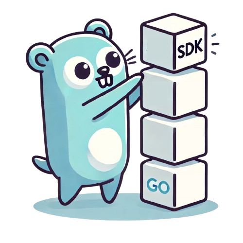

<div align="center">



# go-sdk-gen

`go-sdk-gen` is a highly opinionated OpenAPI specs to SDK generator for [Go](https://go.dev/).

</div>

## Why?

There are existing tools for generating Golang clients based on OpenAPI specs but the generated code often isn't clean and easy to read. `go-sdk-gen` aims to generated code that's closer to what one would write if writing the SDK manually. For example, splitting the generated code into individual files that themselves are well organized.

If you want to see how this looks, checkout the [examples](./examples).

## Quickstart

Install the latest version of `go-sdk-gen` using

```sh
go install github.com/sumup/go-sdk-gen/cmd/go-sdk-gen@latest
```

And generate your SDK:

```sh
go-sdk-gen --mod github.com/me/mypackage --package mypackage --name 'My API' ./openapi.yaml
```

## Overview

`go-sdk-gen` generates structured SDK that is easy to navigate. Operations are grouped under tags and go-sdk-gen works under the assumption that each operation has one tag and one tag only.

When bootstrapping new project go-sdk-gen will generate all the necessary code for a valid SDK. On following runs it will update only code related to your OpenAPI specs but won't touch the client implementation and other files. This leaves you with the option to customize the client and add other features as necessary. You can opt out of this behavior using the `--force` flag.

## Usage

As a bade minimum, you will need to provide full path of your module (if you are bootstrapping new SDK), package name, and the source OpenAPI specs:

```sh
go-sdk-gen generate --mod github.com/me/mypackage --package mypackage --name 'My API' ./openapi.yaml
```

For further options see

```sh
go-sdk-gen help
```

## Use as a library

If you find yourself in a need of customizing the generated code the easiest way to do so is by wrapping the `go-sdk-gen` in your own script and hooking into the OpenAPI specs generation lifecycle.

```go
package main

import (
	"fmt"

	"github.com/getkin/kin-openapi/openapi3"

	"github.com/sumup/go-sdk-gen/pkg/builder"
)

func main() {
	spec, err := openapi3.NewLoader().LoadFromFile(specs)
	if err != nil {
		return err
	}

	builder := builder.New(builder.Config{
		Out:      "./",
		Pkg:      "myapp",
		// TODO: customization here
	})

	if err := builder.Load(spec); err != nil {
		return fmt.Errorf("load spec: %w", err)
	}

	if err := builder.Build(); err != nil {
		return fmt.Errorf("build sdk: %w", err)
	}
}
```

### Maintainers

- [Matous Dzivjak](mailto:matous.dzivjak@sumup.com)
